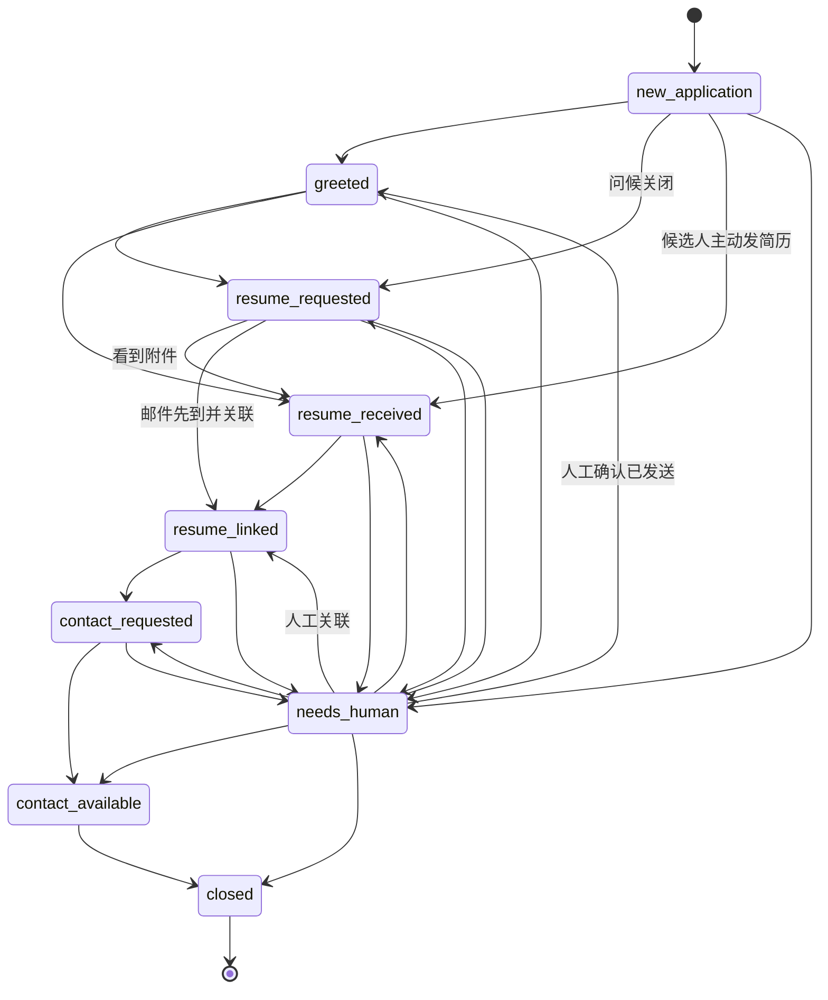
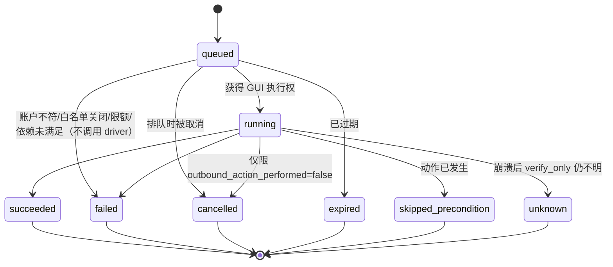
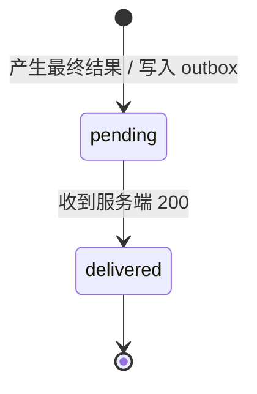

# 招聘 Monitor 契约说明

契约版本：`monitor_contracts.__version__ = "0.2.0"`（2026-10-04）。本文说明 `monitor/contracts/` 的产物，是[方案](monitor-spec.md)第六、七节的落地版本。HTTP 接口见 [api.md](api.md)。

本文中"已验证"只表示 `uv run pytest contracts` 通过的契约层行为，不代表 BOSS 客户端上的任何能力。

## 一、产物与用法

| 产物 | 位置 | 用途 |
| --- | --- | --- |
| JSON Schema（draft 2020-12） | `monitor/contracts/schemas/*.json` | 线上消息格式的权威定义；服务端、控制台、Monitor 共用 |
| `monitor_contracts` 包 | `monitor/contracts/monitor_contracts/` | pydantic v2 模型、`validate_*`、状态机、`compute_event_id`、Protocol |
| 夹具格式 | `monitor/fixtures/schema/ax-fixture.schema.json` | B 录制、C 回放、E/H 测试的脱敏元素树格式 |
| OpenAPI | `monitor/contracts/openapi.yaml` | 服务端 HTTP 接口；消息体直接 `$ref` 上面的 schema |
| 测试向量 | `monitor/contracts/tests/vectors/{valid,invalid}/` | 合法 37 个、非法 41 个，其他任务可直接拿来做 fake 数据 |

```sh
cd monitor && uv sync && uv run pytest contracts
```

其他成员在自己的 `pyproject.toml` 中依赖 `monitor-contracts`（`[tool.uv.sources] monitor-contracts = { workspace = true }`），然后 `from monitor_contracts import ...`。只依赖 `__init__.py` 导出的名字，不要 import 下划线开头的模块。

### 校验分两层

`validate_<name>(data)` 先跑 JSON Schema（结构、枚举、按 action/kind 的形状），有错就停；结构通过后再跑 pydantic（跨字段语义：时间先后、`result_ref` 前缀、`event_id` 是否等于计算值等）。两层的错误都转成 `FieldError(path, message, code, layer)`，路径形如 `payload.text`、`items[0].result_ref`，任何失败都抛 `ContractValidationError`（`.errors`、`.paths`）。只要错误列表、不想抛异常时用 `check(name, data)`。

可校验的契约名：`command`、`command_result`、`event`、`search_snapshot`、`policy`、`device_registration`、`device_heartbeat`、`login_qr`、`ax_fixture`。

模型序列化成线上 JSON 用 `model.to_wire()`（即 `model_dump(mode="json")`）。可选字段在线上允许为 `null`。

## 二、公共约定

- 时间一律是 RFC 3339 且必须带时区（`format: date-time` + pydantic `AwareDatetime`）。
- 所有对象 `additionalProperties: false`：多余字段是错误，不会被静默忽略。
- `conversation` = `{candidate_name, job_title, hints[]}`。Monitor 只有在三者全部一致时才算命中；多处命中就是歧义，不执行。`hints` 里不放手机号、微信号。
- `evidence` 只放脱敏后的元素文本摘录（每条不超过 500 字，最多 50 条），不能放截图或二进制。`observed.before/after` 是 `{code, detail}` 形式的界面事实，`code` 用 snake_case。
- 敏感字段（`provide_input.payload.value`、`enrollment_code`、`qr_payload`）在 pydantic 模型中 `repr=False`，不会出现在日志或异常文本里，但 `to_wire()` 会保留原值。

## 三、指令 command（服务端 → Monitor）

公共字段：`command_id`（UUID）、`workflow_id`（case_id，会话类动作必填，其余必须为 null）、`account_id`、`action`、`execution_mode`（`execute` | `verify_only`，默认 execute）、`target`、`payload`、`issued_at`、`expires_at`（必须晚于 issued_at）、`depends_on`（前置指令，可空，不能指向自己）。

`execution_mode=verify_only`：对应控制台的"重新检查界面状态"。这类指令只调用 `ActionHandler.verify_only`，不受每日上限、最小间隔和白名单开关约束。它允许导航（打开会话、切页签、滚动），不允许任何对外动作，结果的 `outbound_action_performed` 必须为 false（见第四节）。它只用于会话类动作，`search_candidates` 和 `provide_input` 必须是 `execute`。

| action | target | payload | output（结果中） |
| --- | --- | --- | --- |
| `send_greeting` | 会话目标 | `{text}` 1–500 字 | 无 |
| `request_resume` | 会话目标 | `{}`（不接受参数） | 无 |
| `request_contact_exchange` | 会话目标 | `{exchange_type: "phone"}` | `{exchange_type, exchange_state}` |
| `forward_resume` | 会话目标 | `{destination: 邮箱, attachment_hint?}` | `{destination, forwarded_at}` |
| `search_candidates` | `{scope: "current_page"}` | `{search_id, query, max_results 1–100}` | `{snapshot}` |
| `provide_input` | `{input_request_id}` | `{value}` 1–64 字 | 无 |

会话目标 = `{conversation, candidate_ref?, result_ref?}`。`candidate_ref` 是服务端的候选人引用，Monitor 只回显、不用来定位。`result_ref` 表示目标来自某次搜索快照，只说明来源，不能代替身份核对。

各动作说明：

- **send_greeting**：问候。服务端已按策略模板渲染好 `text`，Monitor 不再拼接。执行前要核对目标会话，执行后要读到聊天区出现该文本才算 succeeded。结果为 `unknown` 时，服务端不自动推进求简历（方案 8.1 第 5 条）。
- **request_resume**：请求简历。界面已有"已请求"标记时返回 `skipped_precondition`（`reason=precondition_already_done`）。执行后要读到请求消息出现才算成功。只允许点击 N 阶段记录的那一个确认按钮。
- **request_contact_exchange**：交换联系方式，第一版只支持电话（以后加微信时契约版本 +1）。界面已是 `available` 或 `pending_acceptance` 时返回 `skipped_precondition` 并在 output 中给出当前状态。点击并确认请求已发出时返回 succeeded，`exchange_state=requested`。succeeded 和 skipped_precondition 都必须带 output。"请求已发送"是指令结果，"联系方式可用"是业务事件 `contact_exchange_updated`，两者不要混用。v1 契约不传号码原文。
- **forward_resume**：把附件简历转发到策略指定的邮箱。成功时必须给出 `forwarded_at`，邮件接入（G）按这个时间窗关联邮件。能否实现取决于 N 的结论；做不到时返回 `failed` + `reason=unsupported`，并且不调用写方法。
- **search_candidates**：在当前页搜索，不翻页，`workflow_id` 为 null。见第五节。
- **provide_input**：把控制台人工输入的值（如短信验证码）代填到 `human_input_required` 所指的输入框。值不得写入日志或 evidence。

## 四、结果 command_result（Monitor → 服务端）

字段：`command_id`、`action`、`execution_mode`、`status`、`reason`、`reason_detail?`、`observed`、`evidence`、`navigation_performed`、`outbound_action_performed`、`externally_visible_side_effect`、`executed_at`、`reported_at`、`output`。

跨字段规则（JSON Schema 与 pydantic 都会检查）：

| 条件 | 规则 |
| --- | --- |
| `status=succeeded` | `reason` 必须为 null，`executed_at` 必填 |
| `status ∈ {failed, unknown, skipped_precondition}` | `reason` 必填 |
| `status ∈ {cancelled, expired}` | `executed_at` 必须为 null |
| `status=cancelled` | `outbound_action_performed=false`（导航过可以取消，`navigation_performed` / `externally_visible_side_effect` 如实填写） |
| `status=expired` | 三个标志都为 false |
| `execution_mode=verify_only` | `outbound_action_performed=false`（允许导航） |
| `outbound_action_performed=true` | `externally_visible_side_effect=true` |
| `search_candidates` + succeeded | 必须带 `output.snapshot`，且 coverage 不能是 unreadable |
| `request_contact_exchange` + succeeded/skipped_precondition | 必须带 `output.exchange_state` |
| `forward_resume` + succeeded | 必须带 output |
| greeting / resume / provide_input | output 必须为 null |

`reason` 枚举：

| reason | 含义 |
| --- | --- |
| `action_not_allowed` | 白名单未开启该动作（不调用 driver） |
| `rate_limited` | 触发每日上限或最小间隔（不调用 driver） |
| `target_ambiguous` | 目标多处命中 |
| `target_not_found` | 找不到目标会话或按钮 |
| `unknown_dialog` | 出现未知弹窗，没有点击任何未知控件 |
| `login_required` | 登录失效 |
| `captcha` | 验证码或风控 |
| `account_mismatch` | 有证据表明客户端当前账户与指令账户不一致。v1 仅在有证据时使用（例如界面出现账户切换提示），目前没有检测手段，见第七节"账户来源" |
| `paused` | 设备已暂停，指令未开始 |
| `dependency_not_satisfied` | `depends_on` 的指令没有 succeeded（包括 unknown） |
| `timeout` | 在上限时间内等不到可识别的结果状态 |
| `unreadable` | 界面读不出（例如搜索结果是图片） |
| `unsupported` | 当前版本不支持（例如 forward_resume 没有可行路径） |
| `precondition_already_done` | 动作已经发生过（skipped_precondition 时使用） |
| `verification_failed` | verify_only 确认动作没有发生，或执行后验证不通过 |
| `driver_error` | Driver 抛出窗口丢失、屏幕丢失、CLI 失败等错误 |
| `crash_recovery` | 崩溃恢复后 verify_only 仍然无法确认（配合 unknown） |

### 执行标志（0.2.0 起替代 `gui_write_performed`）

三个布尔标志在线上必填（缺省会把"忘了填"误当成"什么都没做"）；`ActionResult` 里默认 false，处理器必须如实设置。

| 标志 | 含义 | 例子 |
| --- | --- | --- |
| `navigation_performed` | 发生过只改变本机界面的 GUI 操作 | 点击打开会话、切换页签或筛选、滚动、关闭弹层、在搜索框输入关键词 |
| `outbound_action_performed` | 发生过对候选人或第三方可见的动作 | 发送消息、点击确认、提交转发、点击求简历 / 换电话、代填并提交验证码 |
| `externally_visible_side_effect` | 本次执行可能产生了对方可见的副作用 | 对外动作一定算；只打开未读会话也可能产生已读回执，此时没有对外动作但为 true |

服务端用 `outbound_action_performed` 区分"取消前确实没有对外动作"和"做了但结果不明"，用 `externally_visible_side_effect` 判断候选人是否可能已经察觉（例如已读）。白名单关闭、限额、暂停、依赖未满足时 handler 不调用 driver，三个标志都为 false。

与状态机的关系：`running → cancelled` 仅限 `outbound_action_performed=false`。已经导航（甚至已产生已读回执）但还没点任何对外按钮时可以取消，如实填写另外两个标志；对外动作已经发生时不能回报 cancelled，必须回报实际结果。`expired` 只从 `queued` 进入，三个标志都为 false。

## 五、搜索快照 search_snapshot

`{search_id, query, scope: "current_page", coverage, unreadable_reason?, items[], captured_at}`，`items[i] = {result_ref, display_name, summary, stable_candidate_id?}`。

| coverage | items | 结局 `snapshot.outcome` | 指令 status |
| --- | --- | --- | --- |
| `complete` / `partial` | 至少 1 条 | `results` | succeeded |
| `empty_confirmed`（界面明确显示无结果） | 必须为空 | `no_results` | succeeded |
| `unreadable` | 必须为空，且必须填 `unreadable_reason` | `unreadable` | failed + `reason=unreadable` |

`unreadable` 和 `empty_confirmed` 的 items 都是空的，区分只靠 coverage。消费方必须按 `outcome` 分三支处理，不能用"items 是否为空"判断有没有结果。读取失败不得回报为空列表，校验器会拒绝 `unreadable` + succeeded 的组合。

`result_ref` 的格式是 `<search_id>:item_<n>`（n 从 1 开始），前缀必须等于 `search_id`，同一快照内不能重复。它只是本次快照里的位置，不是候选人身份。

## 六、事件 event（Monitor → 服务端，经 outbox 补传）

公共字段：`event_id`、`device_id`、`account_id`（会话类事件必填；登录类和暂停事件在未绑定账户时可以为 null）、`kind`、`conversation`、`bucket`、`observed_at`、`payload`。`event_id` 必须等于 `compute_event_id(account_id, kind, conversation, bucket)`，校验器会重新计算。

| kind | conversation | payload | 说明 |
| --- | --- | --- | --- |
| `application_observed` | 必填 | `{marker_text?, evidence}` | 只对能明确识别为"新投递"的会话产生，普通未读不算。首次启动和 needs_baseline 时只建基线，不产生事件。识别规则来自 B 的夹具标注 |
| `attachment_available` | 必填 | `{attachment_name?, evidence}` | 会话中出现可用的附件简历。服务端据此决定是否下发 forward_resume |
| `contact_exchange_updated` | 必填 | `{exchange_type, exchange_state, evidence}` | observe 看到交换状态变化（例如候选人同意）。v1 不带号码原文 |
| `conversation_ambiguous` | 必填 | `{match_count ≥ 2, candidates[≥2]{position, hints, summary?}, evidence}` | 同一岗位下出现同名会话。服务端转人工处理，不建立新投递。candidates 只放脱敏摘要 |
| `login_required` | null | `{reason, mode}` | 登录失效或回到登录页。Monitor 暂停对外动作。local 模式只通知用户在本机登录 |
| `login_qr` | null | `{qr_seq, expires_at}` | 仅 remote 模式。只通知二维码已更新，二维码内容只经 `POST /login-qr` 上传，过期即删，不进事件表 |
| `login_ok` | null | `{mode, account_display?}` | 登录完成。服务端撤下二维码卡片 |
| `human_input_required` | 可空 | `{input_request_id, input_kind, prompt_text, can_fill}` | 需要人工输入（短信验证码等）。slider、confirm_on_phone、unknown 时 `can_fill` 必须为 false，只上报并等待人工 |
| `blocked_by_dialog` | 可空 | `{dialog_kind, dialog_text, buttons[], command_id?}` | 验证码、风控、配额或未知弹窗阻断。Monitor 暂停相应执行，不点任何未知控件 |
| `device_paused` | null | `{reason, by, detail?}` | 设备进入暂停（用户、登录、换账户、异常、服务端要求、重建基线） |

"不支持的呈现"（E 识别到的界面形态不在规则内）不单独占一个事件 kind，而是放在 `device_heartbeat.last_error`：`code=unsupported_presentation`，必须填 `scene`（页面类别），同一呈现只上报一次。

## 七、其他消息

- **policy**：账户级策略。字段包括 `policy_version`（PUT 用 If-Match 做乐观锁）、`allowed_actions`（对外动作白名单，默认空即全部关闭；provide_input 和 verify_only 不受它控制）、`job_scope`、`greeting{enabled, template}`、`auto_request_resume`、`after_resume_received{action, wait_for_parse}`、`work_hours`（IANA 时区 + 窗口，空窗口表示任何时段都不生成对外指令）、`daily_limits` 与 `min_interval_seconds`（五个对外动作各一项）、`pause_on_anomaly`（只能为 true）、`paused`。Monitor 本地另有写死的硬上限和最小间隔下限，策略只能收紧、不能放宽。这些常量由 D2 定义，不在契约里。
- **device_registration**：`POST /devices` 的请求体。字段包括 `enrollment_code`、`device_name`、`mode`、`platform`、`monitor_version`、`contracts_version`、`capabilities`。local 模式不能声明 `login_relay`。
- **device_heartbeat**：默认 30 秒一次。字段包括 `mode`、`account_id`（绑定账户，见下文"账户来源"）、`client_state`、`paused` + `pause_reason`（paused 时必填）、`needs_baseline`、`current_action`、`queue{queued_commands, undelivered_results, outbox_events}`、`last_error`、`monitor_version`。
- **login_qr**：`POST /login-qr` 的请求体。字段包括 `device_id`、`account_id?`、`qr_payload`（本地解码出的文本，不是图片）、`qr_seq`（内容每变一次 +1）、`captured_at`、`expires_at`（必须晚于 captured_at）、`decoder`。

### 账户来源（0.2.0）

P0 与任务 B 都确认：BOSS 客户端窗口里读不到当前登录的是哪个招聘账户。因此 v1 的规则是：

- `account_id` 来自安装时的绑定：用户在控制台为这台设备确认绑定账户（`PUT /devices/{id}/account-binding`），Monitor 把绑定结果保存在本地。Monitor 不从界面读取账户，也不推断账户。
- `device_heartbeat.account_id` 表示"本机保存的绑定账户"，不是"观察到的账户"；未绑定时为 null。服务端发现它与服务端记录的绑定不一致时，说明是配置问题（例如重装后未重新绑定），不说明用户在 BOSS 里换了账户。
- 指令、事件里的 `account_id` 同样是绑定账户。
- reason `account_mismatch` 和暂停原因 `account_switched` 保留，但 v1 只在有证据时使用（例如界面出现账户切换或被挤下线的提示）。当前没有检测手段，用户在 BOSS 里直接切换账户时 Monitor 察觉不到。这一项列入 N 阶段待验证。

## 八、状态机

迁移表在 `monitor_contracts.states`，只能用 `can_transition_case / can_transition_command / can_transition_delivery`（或 `require_transition` 抛 `IllegalTransition`）判断，不要另写一份。所有层都不允许自迁移，未知状态名抛 `ValueError`。

### 8.1 业务流程（服务端 recruitment_case）



除 `contact_available` 外，每个非终态都可以直接进入 `closed`（停止流程、明确拒绝），图中省略这些边。`resume_received` 指界面上看到了附件简历，`resume_linked` 指邮件里的文件已经关联到本流程。邮件比界面观察先到时，可以从 `resume_requested` 直接进入 `resume_linked`。

### 8.2 指令执行（Monitor command_ledger）



`running` 不能回到 `queued`，否则会重做 GUI 动作。`unknown` 在本机是终态，Monitor 停止自动重试，依赖它的后续指令不执行。人工确认记在服务端的 `manual_actions`，不改写本机结果。重复送达的指令按 `command_id` 返回已有记录，不产生新的迁移。

### 8.3 回传（指令结果与事件 outbox）



## 九、幂等键规则

### 9.1 event_id

```
event_id = sha256_hex( JSON( ["monitor-event-v1", account_id or "", kind, 会话身份 or null, bucket] ) )
会话身份  = [NFC(strip(candidate_name)), NFC(strip(job_title)), sorted(set(NFC(strip(h)) for h in hints))]
```

- JSON 序列化使用 `ensure_ascii=False` 和紧凑分隔符 `(",", ":")`，按 UTF-8 编码后计算哈希。hints 按 Unicode 码点排序。其他语言实现以测试中的金标准值为准（`tests/test_event_id.py::GOLDEN_MATERIAL`）。
- `bucket` 是"观察到的变化时间片"，由观察方决定：优先用界面上能读到的变化时间（例如列表里的消息时间），或者首次看到该变化时记入基线的时间片，保证同一变化在多次观察中算出同一个 id。两者都没有时，用 `observation_bucket(observed_at, width_seconds)` 兜底（UTC 向下取整，例如 `2026-10-04T01:00:00Z/3600`）。
- 服务端按 `event_id` 去重。同一个新投递因为 bucket 不同算出两个 id 时，服务端还会按账户 + 候选人 + 岗位合并到同一个 case，不会重复建 case。

### 9.2 Idempotency-Key（HTTP 写接口）

格式：`^[A-Za-z0-9._:-]{8,128}$`。重试必须复用同一个键，所以键由业务标识确定性地生成。`monitor_contracts` 提供了以下生成函数：

| 接口 | 函数 | 形如 |
| --- | --- | --- |
| `POST /commands/{id}/result` | `command_result_key(command_id)` | `result:<uuid>` |
| `POST /commands/{id}/ack` | `command_ack_key(command_id)` | `ack:<uuid>` |
| `POST /devices/{id}/commands:claim` | `claim_key(device_id, claim_attempt_id)` | 同一次领取尝试的重试复用 attempt id |
| `POST /devices/{id}/heartbeat` | `heartbeat_key(device_id, sent_at)` | |
| `POST /events` | `events_batch_key(event_ids)` | 与顺序无关，相同集合得到相同键 |
| `POST /login-qr` | `login_qr_key(device_id, qr_seq)` | |
| `POST /resume-documents` | `resume_document_key(message_id, sha256)` | |
| 控制台写接口 | 每次用户点击生成一个 UUID | 双击、刷新重放不会重复执行 |

部分内容含不安全字符或超长时，自动退化为 `前缀:哈希`。服务端在 24 小时内对同一个键返回首次的响应；同一个键配不同请求体时返回 422 `idempotency_key_reused`。

## 十、Protocol（其他任务实现）

| Protocol | 实现任务 | 要点 |
| --- | --- | --- |
| `Driver` | C | `state(include_tree=False) -> Snapshot`；`click(target, mode)`、`type_text(target, text)`、`key(keys)`、`scroll(target, direction, amount)` 返回 `ActionReceipt`，失败抛 `DriverError` 子类；`bind_window(selector=None) -> WindowInfo`；`screen_ok() -> bool`；`screenshot_region(rect, out_path) -> Path`（只用于登录二维码）。`target` 为 `Element` 或 `Locator`（text / text_contains / role / region / index / right_of，取交集，必须唯一命中） |
| `ActionHandler` | H1–H3 | 属性 `action`；`run(command, driver, ctx) -> ActionResult`；`verify_only(command, driver, ctx) -> ActionResult`（绝不写）。白名单关闭时返回 `failed/action_not_allowed`，不调用写方法 |
| `Observer` | E | `observe(driver, baseline) -> list[Event]`。可以就地更新 `baseline`，由 core 持久化。`baseline.established=False` 时只建基线、返回空列表 |
| `Ledger` | D1 | 指令幂等写入、按迁移表迁移（非法迁移抛 `IllegalTransition`）、结果与事件的回传状态、补传游标 `outbox_cursor()`、`load_state / save_state(MonitorState)` |

Driver 错误码（`DriverError.code`，可以写入 `heartbeat.last_error.code`）：`window_lost`、`screen_lost`、`timeout`、`snapshot_stale`、`cli_failed`、`target_ambiguous`、`target_not_found`，以及基类 `driver_error`。

`Element` 的字段为 `index, role, label, value, frame, enabled`，另有可选的 `snapshot_id`（由 Driver 填写）和 `parent_index / depth`（仅 include_tree）。`enabled` 为 `bool | None`，默认 None，表示来源不提供（2ndscreen CLI 不输出该字段），不等于不可用。只读属性 `text`：label 去空白后非空就返回 label，否则返回 value，两者不拼接，所以输入框（label=搜索、value=关键词）仍能被 `Locator(text="搜索")` 命中。evidence 默认用这个属性。

Locator 的文本匹配（0.2.0 追认任务 C 的实现）：`text` 在规范化后与元素的 `text`、`label`、`value` 任一相等即命中，`text_contains` 在规范化后是其中任一的子串即命中。规范化是去掉方向控制符（例如 Calculator 值里的 U+200E）、NFKC、合并连续空白、去首尾空白，区分大小写。这样弹出菜单（label=typeface、value=Helvetica）两个词都能定位，静态文本只在 value 上时也能命中。匹配面变宽后命中可能变多，唯一命中的要求不变：作为写方法的 target 时，零个命中抛 `TargetNotFoundError`，多个命中抛 `TargetAmbiguousError`，Driver 不替调用方挑选。

## 十一、夹具格式

`monitor/fixtures/ax/<scene>/fixture.json`，格式见 `ax-fixture.schema.json`，用 `validate_ax_fixture` 校验：

- 顶层：`fixture_version: 1`、`scene`（与目录名一致）、`description`、`recorded_at`、`source{app, app_version?, driver, recorded_by?}`、`redaction{names_replaced, phones_removed, wechat_removed}`（三项都必须为 true）、`steps[≥1]`。
- 每一步：`label`、`window`、`elements[]`（`FixtureElement`：与 Element 相同，但没有 snapshot_id，`index` 必须等于位置，`to_element(snapshot_id)` 可转成 Element），以及 `annotations`。
- `enabled` 可以为 null 或省略。从 2ndscreen CLI 录制的夹具一律为 null，因为 CLI 实测不输出 enabled；不要为了凑值写 true。
- `annotations`：`page`（页面类别）、`conversations[]{element_index, conversation, is_new_application, unread?, ambiguous?}`、`is_new_application[]`（元素 index 简写）、`qr_region`、`expected_events[]`（观察本步后应产生的事件 kind，空列表表示不应产生事件）、`notes`，扩展键必须以 `x_` 开头。
- label、value、窗口标题若含中国大陆手机号样式的 11 位数字，schema 会直接拒绝。这只是兜底检查，不能替代人工脱敏抽查。

## 十二、变更流程

1. 需要改契约的任务在交付报告里写"接口请求"，不要自行修改，也不要复制一份同名类型。
2. 监督者裁决后，由 A 的 worker（或监督者）修改 schema、模型、openapi、本文和测试向量，四者必须同步。
3. 版本号：0.x 阶段每次契约变更时次版本号 +1（0.1.0 → 0.2.0），只改文档措辞时修订号 +1。需要同步修改的地方有 `monitor_contracts.__version__`、`contracts/pyproject.toml` 的 version、`openapi.yaml` 的 `info.version`，测试会检查三者是否一致。
4. 在 `docs/monitor/status.md` 的"契约版本"表登记变更和受影响的任务，并通知这些任务 rebase。
5. 服务端在 `POST /devices` 时比较 `contracts_version`，主版本或次版本不兼容时返回 409 `contracts_version_unsupported`。

## 十三、契约缺口裁决与变更记录

| 问题 | 裁决 |
| --- | --- |
| E 需要"歧义事件" | 新增 kind `conversation_ambiguous` |
| E 的"不支持的呈现只上报一次" | 用 `heartbeat.last_error`，`code=unsupported_presentation` + `scene` |
| 控制台"重新检查界面状态" | 指令增加 `execution_mode: verify_only`，不受限额、间隔和白名单约束 |
| 联系方式事件是否带号码 | v1 不带号码，状态加 `unknown`；是否回传号码由用户另行决定 |
| `workflow_id` | 会话类动作必填；search_candidates 和 provide_input 为 null |
| `reason` 与 status 的约束 | 见第四节 |
| `monitor/uv.lock` | 由 A 提交；后续任务不提交 lock 改动，由监督者合并时统一重新 lock |
| 写操作标志太粗（导航与对外动作混在一起，verify_only 无法导航） | 0.2.0 拆成三个标志，见第四节"执行标志" |
| 账户读不到 | 0.2.0：account_id 来自安装时绑定，不从界面读取；`account_mismatch` 只在有证据时使用，见第七节"账户来源" |
| Locator 文本匹配面 | 0.2.0 追认 C 的实现：text / text_contains 匹配 text、label、value 任一（规范化后），仍要求唯一命中 |

### 变更记录

| 版本 | 日期 | 变更 | 受影响任务 |
| --- | --- | --- | --- |
| 0.1.0 | 2026-10-04 | 首版 | 全部 |
| 0.1.1 | 2026-10-04 | Driver 协议两处修正：`Element.enabled` 改为 `bool \| None = None`（None 表示来源不提供；FixtureElement 与 ax-fixture schema 同步允许 null 或省略）；`Element.text` 改为 label 非空取 label，否则取 value，不再拼接。8.1 中推断的三条迁移经审查全部接受，未改 | C、E、H1–H3、B（夹具） |
| 0.2.0 | 2026-10-04 | ① command_result / ActionResult 的 `gui_write_performed` 拆成 `navigation_performed`、`outbound_action_performed`、`externally_visible_side_effect`（线上必填）：verify_only 只禁对外动作、允许导航；cancelled 禁对外动作；expired 三个全 false；对外动作 ⇒ 对方可见；`running → cancelled` 仅限无对外动作；`ActionHandler.verify_only` 文档同步。② 账户来源：account_id 来自安装时绑定，heartbeat.account_id 是绑定账户而非观察到的账户；`account_mismatch` 保留但 v1 只在有证据时使用，列入 N 待验证。③ Locator 的 text / text_contains 匹配 Element.text、label、value 任一（规范化后），追认 C 的实现。forward_resume 与搜索字段未改 | D1、D2、E、H1–H3、F1（结果入库）、I1（展示）、C（文档追认，无代码变更） |
